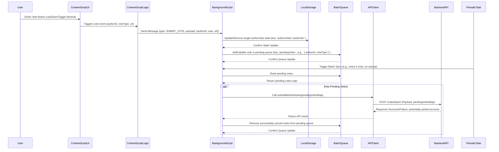

# Author Voting Feature - Implementation Plan (v3 - Batching)

This document outlines the plan for implementing author upvote/downvote functionality in the content signing browser extension, incorporating batching for API calls and a neutral/retract option.

## 1. Summary of Findings

*   **UI:** Voting buttons (up/down, toggling to neutral) should be integrated into the content script (`src/content-scripts/index.ts`), likely within the tooltips or badges generated during verification, associated with author information.
*   **Data Types:** New types `VoteType` (enum: `UPVOTE`, `DOWNVOTE`, `NEUTRAL`) and `AuthorVote` (interface) are needed in `src/core/common/types.ts`.
*   **Storage:**
    *   The user's **single last vote state** per author will be stored locally (key: `authorVotes:${authorId}`). This key is removed if the vote is `NEUTRAL`. This reflects the intended state visible in the UI immediately.
    *   A separate **queue of pending votes** (`Record<authorId, VoteType>`) will be maintained locally (key: `pendingVotes`) to track votes needing synchronization with the server.
*   **API Client:** Requires a new method `submitBatchedVotes` in `src/core/api/content-signing-client.ts`.
*   **API Backend:** Requires a new endpoint `POST /votes/batch` to accept a batch of votes.
*   **Content Processing:** `ContentProcessor` provides `authorId` (from metadata/verification) and context (`url`/`contentHash`).

## 2. Affected Files

*   **Modify:**
    *   `src/content-scripts/index.ts`: Add UI elements (buttons), event listeners, and messaging for voting.
    *   `src/core/common/types.ts`: Add/update `VoteType` enum and `AuthorVote` interface, potentially `BatchedVotesPayload`.
    *   `src/core/api/content-signing-client.ts`: Add `submitBatchedVotes` method, remove/deprecate single vote method.
    *   `src/background/index.ts`: Add message listener for votes, handle local state storage, manage the pending vote queue, implement periodic batch sync logic.
    *   `src/core/common/constants.ts`: Add new `MESSAGE_TYPES` for voting.
*   **Create (Potentially):**
    *   New CSS rules (e.g., in `src/assets/content.css`) for styling vote buttons (active/inactive states).
*   **Backend (External):**
    *   Needs a new API endpoint (`POST /votes/batch`).

## 3. New Types/Interfaces (`src/core/common/types.ts`)

```typescript
/**
 * Represents the type of vote cast
 */
export enum VoteType {
  UPVOTE = 'upvote',
  DOWNVOTE = 'downvote',
  NEUTRAL = 'neutral', // For retracting votes
}

/**
 * Represents a vote cast on an author (used for local state)
 */
export interface AuthorVote {
  /** ID of the author being voted on */
  authorId: string;
  /** The type of vote cast */
  vote: VoteType;
  /** Timestamp when the vote was cast */
  timestamp: number;
  /** Optional: URL of the content where the vote was cast */
  url?: string;
  /** Optional: Hash of the content where the vote was cast */
  contentHash?: string;
}

/**
 * Represents the payload for batch vote submission
 */
export type BatchedVotesPayload = Record<string, VoteType>; // { authorId1: 'upvote', authorId2: 'neutral', ... }
```

## 4. Data Flow (Batching)



## 5. API Changes

*   **Backend:**
    *   **New Endpoint:** `POST /votes/batch` (or similar).
    *   **Request Body:** `{ "votes": { "authorId1": "upvote", "authorId2": "neutral", ... } }` (using `BatchedVotesPayload` structure).
    *   **Authentication:** Requires appropriate API Key (e.g., `GeneralApiKey`).
    *   **Logic:** Process each vote in the batch. For `neutral`, delete the user's vote for that author. For `upvote`/`downvote`, create/update the vote. Handle partial failures.
    *   **Response:** Indicate overall success/failure, potentially detailing status for each vote in the batch.
*   **Client (`src/core/api/content-signing-client.ts`):**
    *   **Remove/Deprecate:** Single vote submission method (e.g., `submitAuthorVote`).
    *   **New Method:** `async submitBatchedVotes(votes: BatchedVotesPayload): Promise<BatchResult>` (Define `BatchResult` based on expected API response).

## 6. Step-by-Step Implementation Plan

1.  **Define Types:** Update `VoteType` enum, ensure `AuthorVote` interface exists, define `BatchedVotesPayload` type in `src/core/common/types.ts`.
2.  **Update Constants:** Add new message types (e.g., `SUBMIT_VOTE`) to `src/core/common/constants.ts`.
3.  **Implement Backend API Endpoint:** Create the new `POST /votes/batch` endpoint on the server.
4.  **Update API Client:** Add `submitBatchedVotes` method and remove/deprecate the single vote method in `src/core/api/content-signing-client.ts`.
5.  **Implement Content Script UI:**
    *   Modify badge/tooltip creation in `src/content-scripts/index.ts` to include vote buttons.
    *   Implement toggle logic (clicking active button sends `NEUTRAL`).
    *   Add CSS for button states (active/inactive) in `src/assets/content.css`.
6.  **Implement Content Script Logic:**
    *   Add event listeners to buttons. Determine `voteType` based on click and current state (toggle to `NEUTRAL`).
    *   Send `SUBMIT_VOTE` message to background script.
    *   Handle UI updates (highlighting) based on local state changes (and potentially acknowledgment messages, though immediate local state update is primary).
7.  **Implement Background Script Logic:**
    *   **Vote Handler (`SUBMIT_VOTE` message):**
        *   Instantiate storage.
        *   Get incoming `voteType` and `authorId`.
        *   Update the local *state* storage (`authorVotes:${authorId}`): `set` if `UP/DOWN`, `remove` if `NEUTRAL`.
        *   Read the current `pendingVotes` queue (e.g., `await storage.get<BatchedVotesPayload>('pendingVotes') || {}`).
        *   Add/update the `authorId: voteType` entry in the queue object.
        *   Write the updated `pendingVotes` queue back to storage (`await storage.set('pendingVotes', updatedQueue)`).
    *   **Batching Mechanism:**
        *   Use `chrome.alarms` API to set a periodic alarm (e.g., `syncVotesAlarm`, every 5-15 minutes).
        *   Add an `onAlarm` listener for `syncVotesAlarm`.
        *   Consider triggering sync on browser startup (`chrome.runtime.onStartup`).
        *   **Sync Logic (in alarm listener/startup):**
            *   Read `pendingVotes` queue from storage.
            *   If queue is not empty:
                *   Instantiate `ContentSigningClient`.
                *   Call `await apiClient.submitBatchedVotes(pendingVotes)`.
                *   On successful API response (handle partial success if needed):
                    *   Create a new queue object containing only the votes that failed or weren't processed.
                    *   Write the new (potentially empty) `pendingVotes` queue back to storage.
                *   Handle API errors (log, potentially implement retry logic for certain errors).
8.  **Testing:** Thoroughly test UI interactions, state storage, queue management, periodic sync, batch API calls, and error handling.